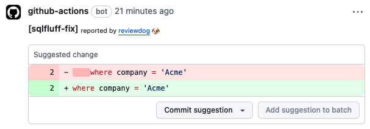
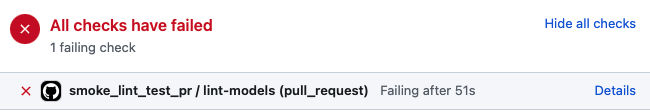
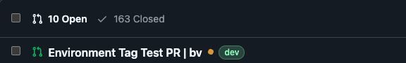
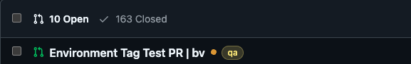
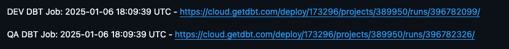

# dbt DataVault

The new repository to hold all data vault models. This will include staging models, raw vault, business vault, and information marts.

## Onboarding

If you are new to this project, [PLEASE READ THE PROJECT DOCS](docs) to onboard the workflow and standards we use for this project. Also, pertinent how-to guides eg. step-by-step how-to to release are available.

## Environment Variables

Environment Variables allow customizations to the behavior of dbt projects depending on the environment being run under. In dbt Cloud these must be prefixed with either `DBT_ENVIRON` or `DBT_ENV_SECRET_`. Environment variables keys are uppercased and case sensitive. 
When referencing `datavault_{{env_var('DBT_ENVIRON')}}` in your project's code, the key must match exactly the variable defined in dbt Cloud's UI.

## Setup (dbt Core)

This project is set up to work in both dbt Cloud and dbt Core. Here is the setup for dbt Core and running the project locally.

### Create a Virtual Environment

1. Create virtual environment

   ```shell
   $ python3 -m venv .venv
   $ source .venv/bin/activate
   (.venv) $
   ```

### Connection Configuration

For some reason, `sqlfluff` doesn't read the global `~/.dbt/profiles.yml`. The fix is to have `profiles.yml` in the root project directory. This file is in `.gitignore`.

1. Create `profiles.yml` from `profiles-example.yml`.
1. Edit `profiles.yml` with the right configurations and credentials.
 
### Install dbt

1. Install dbt, sqlfluff, and tools.

   ```shell
   pip install -r requirements-pip.txt
   ```

1. Perform dbt sanity checks

   ```shell
   $ dbt --version
   Core:
     - installed: 1.7.7
     - latest:    1.7.7 - Up to date!
   
   Plugins:
     - snowflake: 1.7.1 - Up to date!
   $ dbt debug
   ...
   23:33:36  All checks passed!
   ```

1. Install dbt packages

   ```shell
   dbt deps
   ```
   
### Run the linter

1. Run the linter

   ```shell
   sqlfluff lint models
   ```

## SQLFluff

We are using the sqlfluff [jinja templater](https://docs.sqlfluff.com/en/stable/configuration.html#jinja-templater) instead of the [dbt templater](https://docs.sqlfluff.com/en/stable/configuration.html#dbt-templater) as the latter requires a connection to Snowflake whenever sqlfluff is run. This means a more complex setup for CI/CD. For the sake of simplicity, we are using the jinga templater until there is a strong need for the dbt templater.

### Rules

I created a set of rules for sqlfluff that are based on the following standards:

* [dbt Best Practices: How We Style our SQL](https://docs.getdbt.com/best-practices/how-we-style/2-how-we-style-our-sql)
* [Simon Holywell's SQL Style Guide](https://www.sqlstyle.guide)

## Github Actions

For CI setup, we are using the [action-sqlfluff](https://github.com/yu-iskw/action-sqlfluff/blob/main/README.md) Github Action to lint and fix SQL. The notable configurations for the Github Action are:

* `sqlfluff_command`: `'fix'` or `'lint'`.
* `paths`: `<path to the dbt models>`.

The CI has `sqlfluff` set to `'fix'`. This means that the linter leaves comments on any PR to this repo and suggested fixes to any linting violations.



This means that until the linting violations are fixed, we can't merge the PR.



### Running Github Actions Locally

If you are developing Github Actions, you don't want to always rely on the online Github Actions runner on <https://github.com>. This means you have to commit and push the code everytime you make a change. It makes sense to actually run a Github Actions workflow locally for fast feedback and convenience. This is where [act](https://nektosact.com/introduction.html) comes in handy. Here is the installation of `act` and its dependency, which really `Rancher Desktop` as the docker engine for hosting the Github Actions workflows and their constituent steps, which depend on docker.

1. Install docker. We do not use Docker Desktop at FBIN due to licensing. Instead use Rancher Desktop for commercial usage.

   ```shell
   brew install --cask rancher
   ```

1. Install act.

   ```shell
   brew install act
   ```

1. Launch docker, preferably run it as sudo so that the docker daemon will be launched in its well known port.
1. Run the Github Actions workflows locally.

   ```shell
   cd "${PROJECT_ROOT}" # act will look for the directory .github/workflows
   act
   ```

   You can also run it in dryrun mode, which basically parses the workflow yaml files. It's useful to check that the yaml files are well formed and syntactically correct.

   ```shell
   act --dryrun
   ```

## Automatic Environment Tracking
The CI/CD pipeline automatically applies and updates PR labels to track deployment progress across environments.

The workflow applies visual indicators to PRs that show which environment a change has progressed to.

A PR will only have one environment label at a time. 
Labels are updated automatically as deployments progress through environments.  
The current environment tag provides a quick visual indicator of deployment status

**Dev Environment Label**



**QA Environment Label**



**Note:**
Labels must be manually created in GitHub UI before they can be used as environment labels. 


## Automatic dbt Cloud Run Links
The CI/CD pipeline automatically enhances pull request descriptions with detailed deployment information:

Deployment Documentation Features
- **Environment-Specific Links:** Each environment (DEV, QA) gets its own section with a direct link to the corresponding dbt Cloud job run
- **Timestamp Tracking:** Each deployment is timestamped (UTC) for audit trail and troubleshooting
- **Progressive Updates:** Information builds as the PR moves through environments



Benefits
- **One-Click Access:** Review build results, logs, and SQL directly from GitHub
- **Team Visibility:** All stakeholders can easily track deployment status and access the DBT build
- **Audit Trail:** Timestamps provide clear deployment timeline for governance

This automated documentation system removes the need to manually search for job runs in dbt Cloud, streamlining development and review workflows.

## Full and Incremental Model Refresh Strategy
The CI/CD pipeline intelligently handles different refresh strategies for dbt models:

Full and Incremental Refresh Execution
For each environment, the pipeline performs two separate dbt runs automatically:

1.  Full Refresh Run:
      - Executes dbt build --select <changed_models> --full-refresh
      - Completely rebuilds models, including table recreations
      - Ensures proper initialization of models with a clean slate
      - seful for detecting schema changes and configuration issues

2.  Incremental Refresh Run:
      - Executes dbt build --select <changed_models> (without full-refresh)
      - Follows standard incremental loading patterns when applicable
      - Tests models in their regular operating mode
      - Validates incremental loading logic functions correctly

Benefits of Dual Execution Strategy
- **Complete Testing:** Ensures models work in both initial load and incremental scenarios
- **Regression Prevention:** Catches issues that might only appear in one refresh mode
- **Efficiency Validation:** Confirms incremental models properly filter for new data
- **Early Problem Detection:** Identifies schema drift or incompatible changes before production
The PR description is automatically updated with results from both runs, providing clear visibility into how models perform under different refresh strategies.


This dual-execution approach provides confidence that models will work correctly both during initial deployment and ongoing incremental processing.


## References

* [SQLFluff](https://docs.sqlfluff.com/en/stable/)
* [Act](https://nektosact.com/introduction.html)
* [dbt Docs: Lint and Format Your Code](https://docs.getdbt.com/docs/cloud/dbt-cloud-ide/lint-format)
* [dbt Best Practices: How We Style our SQL](https://docs.getdbt.com/best-practices/how-we-style/2-how-we-style-our-sql)
* [Simon Holywell's SQL Style Guide](https://www.sqlstyle.guide)