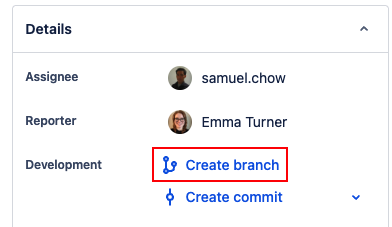
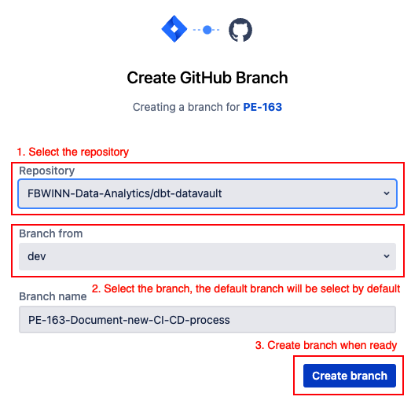

# Branching

## Branch Naming Convention

When we create a branch in this repo, we should follow this convention:

```
<JIRA-Ticket-Uppercase>-<Descriptor>
```

* JIRA ticket number in upper case e.g. `PE-111`.
* Use kebab case, i.e. use dashes to separate the words.
* Descriptor should be short and sweet. No more than 50 characters.
* Descriptor can be case insensitive. Some flexibility here.

Here are a few examples of the naming conventions:

* Bad
  * `pe-100-lowercase-jira-ticket`
  * `PE-115_look_a_snake_case`
  * `PE-120-extra-long-descriptor-that-is-needs-lots-of-typing`
* Good
  * `PE-123-Build-PO-Raw-Vault`
  * `PE-111-wiki-on-practices`

There will be exceptions; but in general, we should create a new branch, we should have created a JIRA ticket beforehand, which is in general a good practice. Do what is practical especially for some quick tasks for clean-up or quick fixes; but for big changes, we should have a Jira ticket that way we can track the work as a team.

## JIRA Integration 

Since the branch name is tied to a JIRA card, it makes sense we can manage the creation and removal of a git branch from JIRA. And with the Github-JIRA plug-in now installed, we can.

Here's a step-by-step guide to creating a brannch from a JIRA card.

1. Go to a JIRA card and drill down to it. You should see **Create branch** on the right side.



1. You will be navigated to a page that lookslike this, but you have be sure to select the correct repo and branch. It does force the Jira ticket uppercasing and gives you the hyphenated ticket name automatically. It will keep the case of the Jira ticket tile.



## dbt Cloud

The other good option is creating the branch directly from dbt Cloud IDE. This will force it to always be the correct repo and branched from "dev". However, the engineer would need to remember or copy the Jira Ticket number and type out the title/branch name manually.
