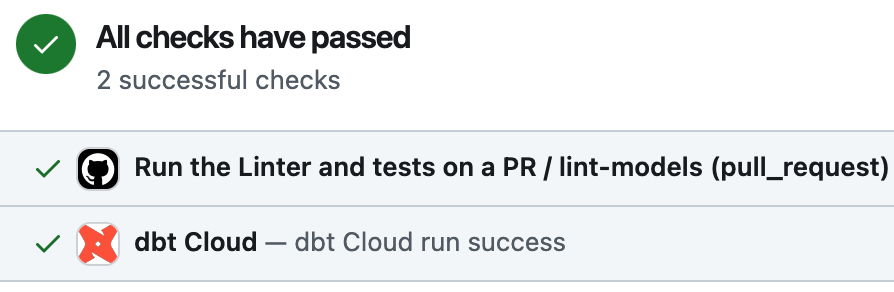
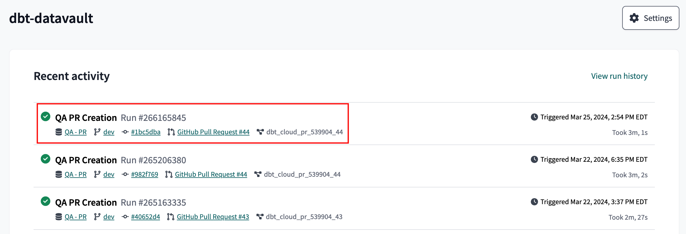
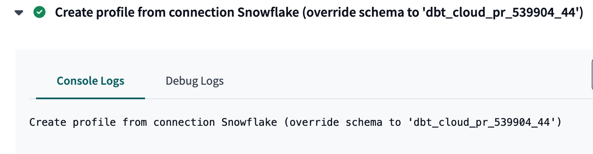

# CI/CD

## Overview

* CI, short for continuous integration, is a process where software engineers integrate code into the project repo. Each integration can be verified by automated build, test, and other validation means. 
* CD, short for continuous deployment (also known continuous delivery), is a process of automated push of the project codebase to runtime environments, especially production.

## Workflows

Here is a summary of the CI/CD workflows associated with this project. Read the sections for details.

| Workflow                                             | Trigger                                         | Description                                                                                                                | Source code/config                                                         |
|------------------------------------------------------|-------------------------------------------------|----------------------------------------------------------------------------------------------------------------------------|----------------------------------------------------------------------------|
| `lint-test-pr.yml` (Github Actions)                  | PR created                                      | Run the linter against the changes in a PR.                                                                                | [Link](../.github/workflows/lint-test-pr.yml)                              |
| QA PR Creation (dbt Cloud)                           | PR created                                      | Build an emphemeral schema on Snowflake to test the PR changes.                                                            | [Link](https://cloud.getdbt.com/deploy/173296/projects/343806/jobs/539904) |
| `copy-pre-release-to-qa-branch.yml` (Github Actions) | Pre-release created                             | Force push the changes on `dev` to the `qa` branch and then build a qa environment from `qa` branch.                       | [Link](../.github/workflows/copy-pre-release-to-qa-branch.yml)             |
| QA Deploy (dbt Cloud)                                | Call dbt Cloud API (from the previous workflow) | Build and deploy the model changes to the Snowflake qa environment                                                         | [Link](https://cloud.getdbt.com/deploy/173296/projects/343806/jobs/540883) |
| `production-branch-from-qa.yml` (Github Actions)     | Release created                                 | Force push the changes on `qa` to the `main` branch. **Note:** this workflow does not trigger the deploy job on dbt Cloud. | [Link](../.github/workflows/production-branch-from-qa.yml)                 |
| Prod Deploy (dbt Cloud)                              | Manual                                          | Build and deploy the model changes to the Snowflake prod environment                                                       | [Link](https://cloud.getdbt.com/deploy/173296/projects/343806/jobs/539930) |
| `create-initial-prod-branch.yml` (Github Actions)    | Manual (one-time setup)                         | This is a workflow hat is run once manually to perform the needed setup                                                    | [Link](../.github/workflows/create-initial-prod-branch.yml)                | 

## Lint Test on PR (Github Actions)

This CI runs the linter for every new PR created. We can't merge a PR until the issues reported by the linter are fixed. See [SQLFluff and linting](code_style.md#sqlfluff) for details. The warnings and errors are displayed inline on the PR.

> **Note**
> 
> The creation of a new PR triggers 2 workflow jobs simultaneously: `lint-test-pr` on Github Actions and `QA PR Creation` on dbt Cloud. This why we see this check whenever we create a new PR.
> 
> 

## QA PR Creation (dbt Cloud)

This is a dbt Cloud job that is triggered by the creation of a PR for merging a feature branch to `dev`.

1. A job called `QA PR Creation` on dbt Cloud is triggered. For example, `QA PR Creation Run #266165845` is triggered by PR #44 on `dbt-datavault`.

   

1. Notably, this job creates an ephemeral schema with this naming convention `dbt_cloud_pr_<dbt_cloud_job_id>_<pr_mumber>` on Snowflake that serves as a temporary environment for testing the code changes associated with the PR.

   

> **Note**
> 
> The ephemeral schema on Snowflake will remain until the PR is merged. This gives QA a chance to inspect actual data in Snowflake along with seeing the dbt code changes in GitHub.

## Copy Pre-Release to QA (Github Actions)

This is a Github Actions workflow that is associated with a [Pre-Release](release.md#github-release).

Here is a summary of what this workflow does:

* Clone the `dev` branch of the repo into the local Github Actions CD environment.
* Perform a `git push --force` (yes, force) to the `qa` branch, overriding and starting a clean stale of `qa` for the subsequent build and deployment.
* We trigger the `QA Deploy` job on dbt Cloud via an API call to build the data models on QA based on the changes on the Pre-Release.

Please review the [Release process](release.md) for details and the sequence of steps to create a Pre-Release and Release.

## Deploy QA to Prod (Github Actions)

This is a Github Actions workflow associated with a [Release](release.md#github-release). 

* The workflow setup is the same as that of the previous workflow, but for merging the `qa` branch to the `main` branch (or the `qa` environment to `prod` environment).
* However, this workflow job does not trigger a dbt Cloud job. Read [below](#prod-deploy-dbt-cloud) for details.

## Prod Deploy (dbt Cloud)

This is a dbt Cloud job that builds and deploys changes in the `main` branch to the prod environment. This job isn't triggered by any other job. So if we want to deploy the changes to prod, we need to run this job.