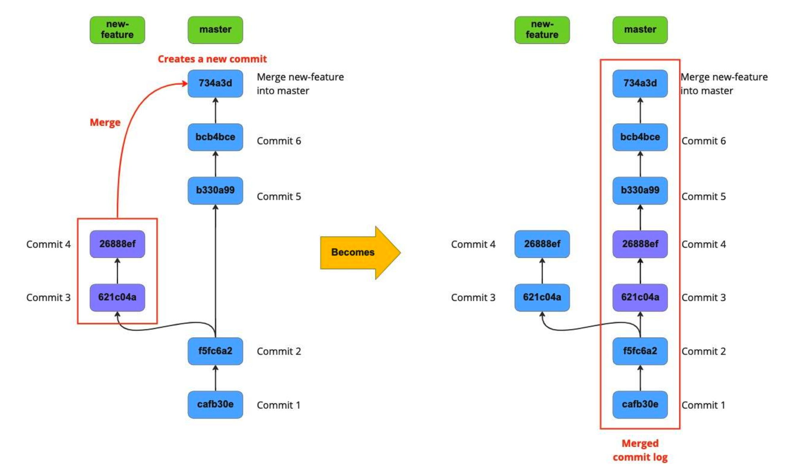
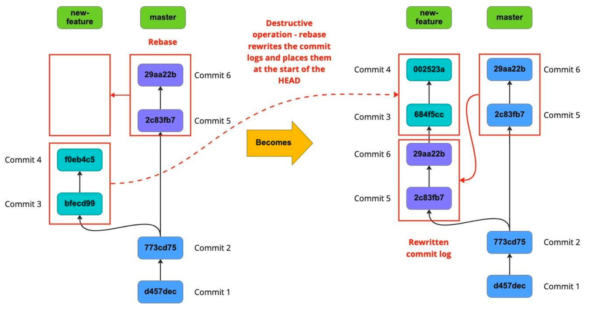
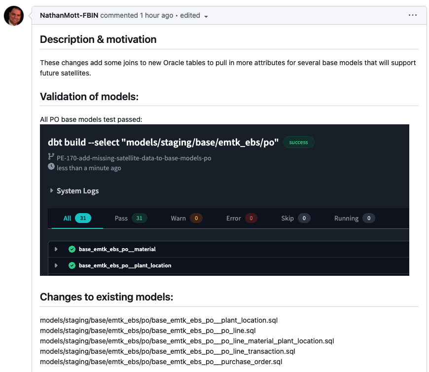
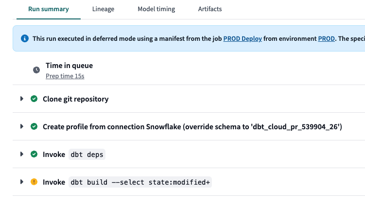
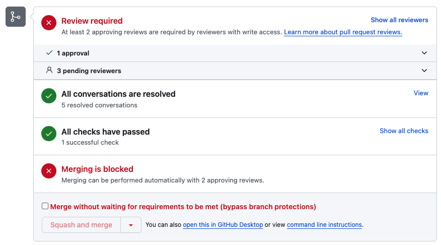
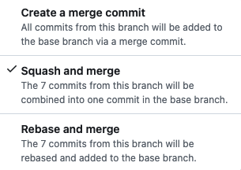
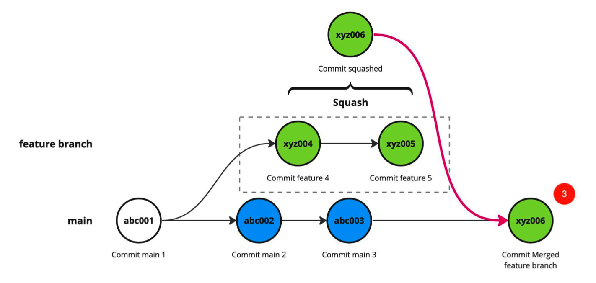

# Commit and Pull Request (PR)

## Commit

We will keep the rules for commit simple and easy to follow. 

Some best practices for committing code using git:

* We encourage contributors to make more frequent commits, especially to their feature/fix branch. It is important to understand that the feature/fix branch is the author's workspace for developing his/her work in isolation. Because of this, don't be afraid to make frequent commits, which form the snapshots to your work. This way we can always revert back to a previous working "snapshot" easily.
  * **Perform a commit before making any big,breaking changes**.
* We are iterating through logical steps, so each commit should be independent. In other words, each commit should be executable, free of syntax errors (ie. builds and passes linting), and passes unit tests. Because there is still a good chance that a commit can get merged into the base branches. We still want the commits to be independent as possible.
* Do not leave a fix/feature branch open for too long. The further your fix/feature branch is behind the parent branch, the likelihood of code conflict increases.
* Code conflict is inevitable especially when working in a team with multiple people. It's far easier to resolve code conflicts when the conflicts are far and few than when it's big and complex. So sync the parent branch to your fix/feature often enough to catch up. You can run `git checkout my-feature-branch; git rebase dev` or condense 2 commands into 1: `git rebase my-feature-branch dev`. 
* Diff is your best friend.
  * Do a diff of your current work with what has been pushed to a branch. `git diff my-branch`.
  * Do a diff of your current work with a previous commit. `git diff HEAD`.
  * Do a diff of your current work with what's on Github (remote). `git diff origin/dev`.
* Push to Github after every commit or a few times a day. At least you save a copy of your work in the Cloud.
* If you have way too many commits in your branch, do a interactive rebase and combine several commits into one. You can even reword the commit messages if you want. `git rebase -i HEAD~4  # Rebase the last 4 commits`.

In conclusion, think of commit as your fail safe and undo feature when coding.

### Commit Messages

For commit messages, here are some rules to follow:

* Subject (Mandatory)
  * Limit the subject line to 50 characters - keep it terse.
  * Start with capitalized word (see blow) and end the subject without a period
  * As much as possible use an imperative present active verb like Add, Refactor, Fix, etc - see below for some commonly used verbs.
* Body (Optional) - if the subject can explain the context well, there's no need for body especially if you are going to squash the commits when merging.
  * To add a body. Add a blank line after the subject to separate the subject from the body.

This is a guide on the relevant verbs we should use for the commit subject line. The list is based on [Joel Henderson's verb list](https://github.com/joelparkerhenderson/git-commit-message?tab=readme-ov-file#summary-keywords) Feel free to use any verb as you see fit.

* Add: Create a capability e.g. feature, test, dependency.
* Drop: Delete a capability e.g. feature, test, dependency.
* Fix: Fix an issue e.g. bug, typo, accident, misstatement.
* Bump: Increase the version of something e.g. a dependency.
* Make: Change the build process, or tools, or infrastructure.
* Start: Begin doing something; e.g. enable a toggle, feature flag, etc.
* Stop: End doing something; e.g. disable a toggle, feature flag, etc.
* Optimize: A change that MUST be just about performance, e.g. speed up code.
* Document: A change that MUST be only in the documentation, e.g. help files.
* Refactor: A change that MUST be just a refactoring patch
* Reformat: A change that MUST be just a formatting path, e.g. change spaces.
* Revise/Refit/Refresh/Renew/Reload: A change that MUST be just a patch e.g. update test data, API keys, etc.

* Capitalize the summary.

  | Bad         | Better      |
  |-------------|-------------|
  | add feature | Add Feature |

* No trailing period.

  | Bad            | Better         |
  |----------------|----------------|
  | Fix the joint. | Fix the joint  |

* Use imperative present tense verb.

  | Bad                    | Better               |
  |------------------------|----------------------|
  | Documented sales model | Document sales model |

These rules are simple and easy to use, which should benefit the team when applied by everyone in the team.

## Merge vs Rebase

Understand the difference between merge and rebase is critical. 

> **Rebase when you update a feature (child) branch with a base branch. Merge when you need to integrate a feature (child) branch to a base branch.** 

### Merge

Merge is easy to understand. The commits of an existing source branch simply gets integrated into the target branch. Nothing is changed on both the source and target branches, the commit logs on both branches remain exactly the same. It is a non-destructive operation. For this reason, git merge is perfect for merging a feature branch to the base branch.

On the other hand, this also means that there are extraneous commits potentially adding substantial "noise" to the target branch. This can be resolved with a squash. See [Squash](#prefer-squash-merge) for details.

### Rebase

Rebase is a bit more complex. Bu once you understand how it works, it makes sense why rebase is preferred for updating a feature branch with the base branch than merge. Rebase does 2 things:

1. Rewrites the commit log of the target branch into a new commit log.
2. The commit log of the source branch is placed at the start of the target branch and then the new commit log is move to the tip. You can think of a rebased commit logs as resetting a starting point for comparisons by keeping the commit history contiguous and separate. See the image below for details.

As you can see, rebase allows us to establish a clean history by stacking the commit log of main with feature linearly. This allows anyone in the team to navigate any point in the commit log with ease.

## Pull Request

Opening a PR is the last step in your dbt development process. As a coder, it is a final checkpoint. As a reviewer, you are offering to review the changes of another team mate to help improve code quality and foster understanding of the code. Having a template sets a standard for teams to know what to expect, review, and approve especially when the volume of PRs is high spread across multiple teams and projects.

### PR Template

The PR template is used to fill the pertinent information whenever a PR is created. We are focus on being succinct and having the right amount of context and information so that we have sufficient info to convey the pertinent without getting to bogged down with too much details.

> Less is more, none is not. Be succinct 

Here is a guide to the information that needs to be filled in a PR:

* **Mandatory**
  * **Description & motivation** - A generic intro to you PR stating what is the purpose and need of this code and what exactly is the goal attained. You should also add in your JIRA ticket link here for ease of further description and/or acceptance criteria. You have the context that the code reviewers don’t, so a simple description goes a long way
  * **Outline of changes** - To increase quality and value of code review feedback, write a good summary of what the code changes are. We don't have to highlight every changes, just the pertinent stuff, like:
    * What was changed
    * What to look for in a code review
    * If needed, why you change it 
* **Optional**
  * **Documentation** - This doesn't need to be in the PR per se. For big, complex changes, please include documentation in the form of:
    * Description in the PR - if it's small enough and specific to the PR.
    * Add it to the README.md or any existing markdown files - if it's small enough and has broader implications and relevance to the project.
    * Add new markdown files - Big breaking changes that must be documented.
  * **Checklist** - A simple checklist as a guide for the author to perform a sanity check on things that need to be done before merging.

A good PR looks like this:

### Continuous Integration

The creation of PR automatically triggers 2 CI runs:

* Github Actions for running the (sql and jinja) linter and unit tests. See [Github Actions workflows for this project](../.github/workflows). Check on the Actions tab to check the status of the CI run.
* dbt Cloud build job - This dbt Cloud job creates a dynamic, ephemeral schema on the dev environment on Snowflake where changes made in the PR will be built against that dynamic schema. Once the PR is closed, the dynamic environment will removed. The name of the schema followings this convention: `dbt_cloud_pr_<project-id>_<pr-#>`.

### PR Merge Criteria

We open a PR so that we merge our changes to a branch. In order to main quality and integrity of our code changes as well as the project codebase, we must have some checks in place. Hence there are a set of criteria that must be satisfied ie. green-lit, before we can merge a PR to a branch.

* There must be at least 1 reviewer to approve the PR before we can merge.
* The PR must pass the CI workflow ie. the linter and unit tests (for now).
* Comments made as part of a code review should be fully resolved.
* There are no merge conflict detect between the branch we are merging and the target branch.

Here is a screenshot of a PR that isn't green-lit for merging. In this example, CI checks and conversations of the code review passed; but the PR author still unable to merge (can't even select on the UI) until we get approvals at least 2 designated reviewers. Because 

Once everything passes, we will see all checks green-lit and the merge selection available for the PR author to merge.

### Code Review

Code review is a big part of a PR. In this section, we will discuss the flow of initiating a code review of a PR and the best practices for a code review. Here are some best practices when reviewing code.

Best practices for the author:

* Aim for small, incremental changes. Why?
  * The quality and value of code review feedback decreases with increasing size of code changes.
  * Don’t combine bug fix, new feature, refactoring, etc into 1 PR - Each is a separate PR
  * A clear purpose makes the reviewing job much easier and increases the feedback value
* Before you ask people to review your work, read through your PR carefully.
  * There is nothing worse than asking several people to look through the code and give feedback on issues you could have fixed yourself. Reading your PR helps you to discover things sometime you can’t find from coding.
* Get the right reviewers to review your code.
  * If you are making breaking changes to an area that someone else had actively designed or owned, please include that person in the PR.
  * If you are new to a design pattern or SDK/API, include someone who had experience in that domain.
  * Include experienced reviewers for valuable insights
  * Include inexperienced reviewers for them to learn from your code, especially if you know that person will work on the code. **By inexperience, it doesn't pertain to junior engineers**. Someone who is senior but has not worked on the code, he/she can still benefit from learning.
* Open to feedback. Always assume that the reviewer has the best intention!

Best practices for the reviewers:

* Be compassionate before being precise with the review. Here are some guideline:
  * Be inquisitive and ask questions - this opens up a dialogue.
  * Make it about the code.
  * Don't be sarcastic or condescending.
  * Explain your reasoning when needed.
* Some phrases that can help:
  * _"What do you think about..."_
  * Instead of _"You should do this..."_ try _"This code does not close the connection..."_
  * Instead of _"There’s no variable..."_ try _"I find it easier to read with a variable for context than a literal value, which doesn’t convey context..."_
  * Instead of _"This code should be more optimized"_ try _"It would help if we add..."_
  * Preface with _"Nitpick"_ or _"Nit"_ for trivial suggestions.
* If need be, talk with the PR author in person.

### Who should be in PR?

Based on the standards we outlined in the previous section, it is clear that code review is used primarily to review changes collectively as a team. Consider the following when you add people to your PR:

* I am adding a new feature or changing a business logic for the first time, I need someone who is familiar with the logic, rules, and design to review my work.
* I am adding a new area of the codebase, I need someone who worked on the code to review my code so that I am not missing anything. If the changes are complex enough, I want to pair and review the work with the person. Look at the commit log history on who made the changes.

## Merge

Unless there is a valid reason eg. a release is due out at end of day and the PR is ready but the author is on PTO, **please let the author merge his/her PR.**

There are 2 commit strategies available in Github for merging a branch:

* Merge commit
* Squash and merge

We can find these merge strategies on a PR.

### Prefer Squash Merge

While both strategies are accepted for use, strongly prefer the squash and merge option especially if you have a lot of commits in the branch you are trying to merge. It is a good practice to commit often so that we have sufficient snapshots that we can undo our work with confidence. But too many commits can get noisy especially when this merge commits from other branches as well. Hence we squash and merge. Basically a squash means that we combine all commits in a branch into one commit (hence squash) and merge that one commit to the target branch.

However, there are cases when merge commit makes more sense for situations where we do want to have more granular insights to individual commits especially with hot fixes.

