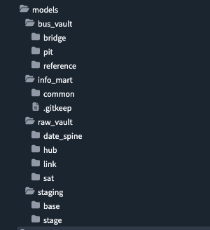
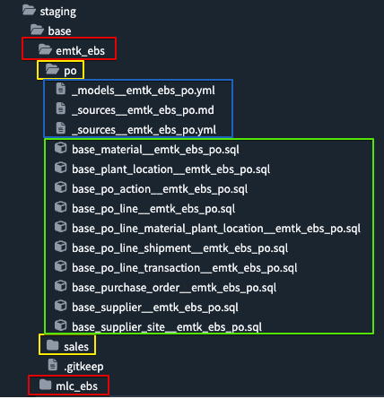
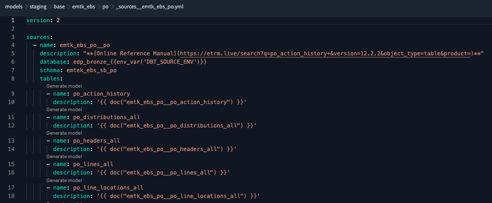
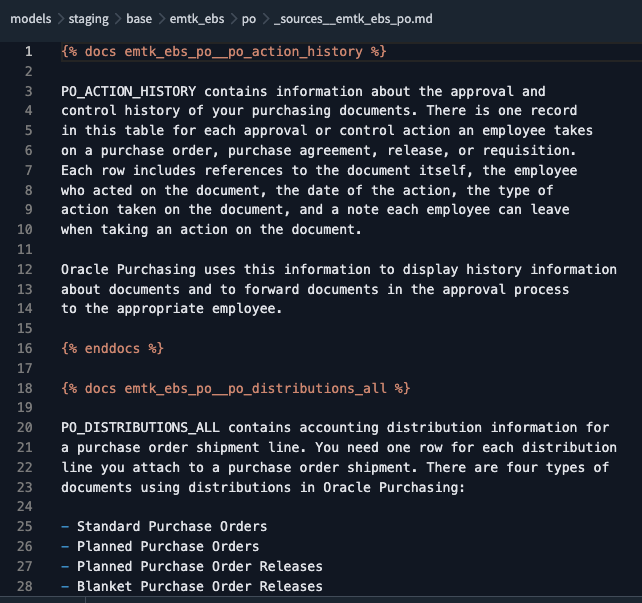
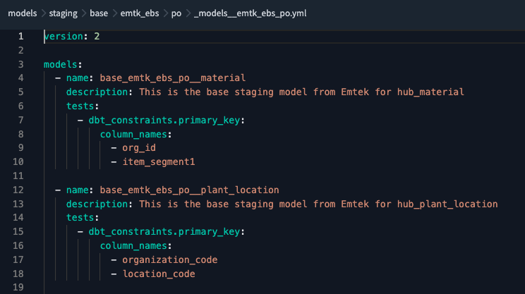
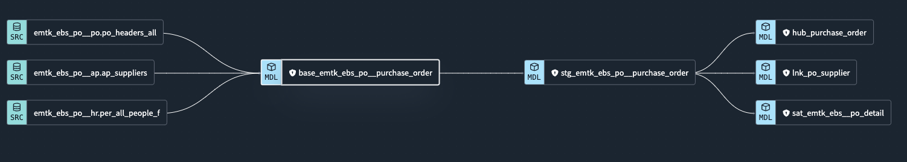
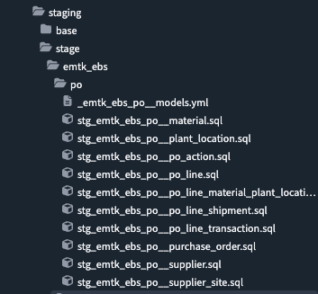
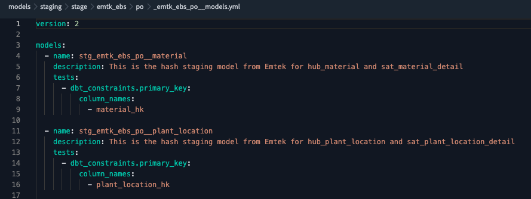

# Data Vault Specific Coding Standards
<!-- TOC start (generated with https://github.com/derlin/bitdowntoc) -->

* [Models Folder Structure](#models-folder-structure)
* [Staging - Base (/models/staging/base)](#staging-base-modelsstagingbase)
  + [source system (red boxes)](#source-system-red-boxes)
  + [source system flavor (yellow boxes)](#source-system-flavor-yellow-boxes)
  + [dbt source and model yaml files (blue box)](#dbt-source-and-model-yaml-files-blue-box)
  + [base model sql files (green box)](#base-model-sql-files-green-box)
      - [Structure](#structure)
      - [Style](#style)
* [Staging - Stage (/models/staging/stage)](#staging-base-modelsstagingstage)
  + [Structure](#structure-1)
  + [Style](#style-1)
      - [YAML Block](#yaml-block)
      - [Build Dictionary From YAML](#build-dictionary-from-yaml)
      - [Set Variables From Dictionary](#set-variables-from-dictionary)
      - [Pass Variables to AutomateDV Stage Macro](#pass-variables-to-automatedv-stage-macro)
  + [Models YAML](#models-yaml)
* [Raw Vault](#raw-vault)
  + [Structure](#rv-structure)
  + [Hub Style](#rv-hub-style)
      - [Set Variables From Dictionary](#rv-hub-set-variables-from-dictionary)
      - [Pass Variables to AutomateDV Hub Macro](#rv-hub-pass-variables-to-automatedv-hub-macro)
      - [Hub YAML](#rv-hub-yaml)
  + [Sat Style](#rv-sat-style)
      - [YAML Block](#rv-sat-yaml-block)
      - [Build Dictionary from YAML](#rv-sat-build-dictionary-from-yaml)
      - [Set Variables From Dictionary](#rv-sat-set-variables-from-dictionary)
      - [Pass Variables to AutomateDV Sat Macro](#rv-sat-pass-variables-to-automatedv-sat-macro)
      - [Sat YAML](#rv-sat-yaml)
  + [Link Style](#rv-link-style)
      - [YAML Block](#rv-link-yaml-block)
      - [Build Dictionary from YAML](#rv-link-build-dictionary-from-yaml)
      - [Set Variables From Dictionary](#rv-link-set-variables-from-dictionary)
      - [Pass Variables to AutomateDV Link Macro](#rv-link-pass-variables-to-automatedv-link-macro)
      - [Link YAML](#rv-link-yaml)

<!-- TOC end -->

<!-- TOC --><a name="models-folder-structure"></a>
## Models Folder Structure
In a large monorepo for a data vault project, it is important to organize the dbt models. We do this using a folder structure that aligns with data vault structure as well as some of dbt-lab's structure best practices. As with most everything in dbt, the folder and file names will be [lowercase](code_style.md#use-lowercase) and snake_case. 

In the following sections, we will break down each folder in the order of the data flow and explain what is placed in each one.




<!-- TOC --><a name="staging-base-modelsstagingbase"></a>
## Staging - Base (/models/staging/base)
This is our lowest level of dbt models. All new data sources should start here. The sub folders and files break down as follows:
  

<!-- TOC --><a name="source-system-red-boxes"></a>
### source system (red boxes)
  - combine four-letter FB Brand with source system technology name abbreviation
    * "emtk" for brand Emtek
    * "ebs" for Oracle EBS (ERP system)
    
<!-- TOC --><a name="source-system-flavor-yellow-boxes"></a>
### source system flavor (yellow boxes)
  - This is a sub-division of your source or data vault model
  - It provides a logical way to divide models from a single source system
  - Any name that makes sense but shorter is better
    * e.g. "po", "sales", "material", "orders"
<!-- TOC --><a name="dbt-source-and-model-yaml-files-blue-box"></a>
### dbt source and model yaml files (blue box)
  - All of these files should start with an underscore(_) to push them to the top of the model list
  - The suffix for the file should be a double underscore(__) followed by source system and source system flavor
  - The sources.yml file should have the following elements shown below at a minimum. For long table descriptions, use a separate sources.md file to hold docs sections:
  
  
  - The model.yml file will have your descriptions and tests for your base models. Use the dbt_constraints package to implement tests - even for models materialized as views

  

<!-- TOC --><a name="base-model-sql-files-green-box"></a>
### base model sql files (green box)
<!-- TOC --><a name="structure"></a>
#### Structure
  - The sql files should be prefixed with "base_" and suffixed with "__<source_system>_<source_system_flavor>"
  - (TBD - more to come on naming and grain of the base models)
  - A single base model can support multiple raw vault models - a hub, satellite and sometimes even a link:
      
<!-- TOC --><a name="style"></a>
#### Style      
Inside the base model files will be coded SQL with these guidelines:

1. Make sure you are querying most recent versions of records from your source (depending on ingestion method). If you using Fivetran with soft-deletes, this means applying `WHERE _fivetran_deleted = false` 
2. Prefix all CTE's with `cte_`
3. Keep original source system column names as much as possible (friendly names applied in bus_vault or info_mart layer) 
4. Only keep source system columns that have meaningful data for analysis (exclude completely empty fields) 
5. Add in an ingestion load timestamp if available. For Fivetran, this is `_fivetran_synced` (this will be load_dts later)
6. In final `SELECT`, move Business Key fields to the top – for remaining columns try to keep original source system order
7. Be sure to run the  
 
 For an example of the style above see [base_emtk_ebs_po__purchase_order](/models/staging/base/emtk_ebs/po/base_emtk_ebs_po__purchase_order.sql)  

 <!-- TOC --><a name="staging-base-modelsstagingstage"></a>
 ## Staging - Stage (/models/staging/stage)
 This layer is 1:1 with the base models. The staging models with use the [AutomateDV](https://automate-dv.readthedocs.io/en/latest/tutorial/tut_staging/) package to easily add hashed fields and other Data Vault required fields.

  
<!-- TOC --><a name="structure-1"></a>
### Structure
  - The folder structure here should mirror what was done for `/staging/base` [above](#source-system)
  - There will only be a models.yml (no sources) here. It can be named with the same pattern as for the [base folder.](#dbt-source-and-model-yaml-files) If descriptions for the staging models get too long, a .md file can be created to hold docs sections (not pictured)
  - Each SQL model file should be prefixed with "stg_<span style="color:red">source system</span>_<span style="color:yellow">source system flavor</span>__"
  - The remainder of the name should match its [upstream model from the base]() folder

<!-- TOC --><a name="style-1"></a>
### Style
- For stage models, we will use the [per-model YAML strings](https://automate-dv.readthedocs.io/en/latest/metadata/#per-model-yaml-strings) option to build up the metadata to pass into the [AutomateDV staging macro](https://automate-dv.readthedocs.io/en/latest/tutorial/tut_staging/). The model file will still be .sql, but inside will be mostly jinja broken down into four basic sections:
1. Set YAML block
2. Build dictionary from yaml
3. Set variables from dictionary
4. Pass variables to AutomateDV stage macro

<!-- TOC --><a name="yaml-block"></a>
#### YAML Block
 - Most of the logic will go in this YAML block. Each section will correspond to a parameter that will be pass to the AutomateDV macro (some may not be used)
 - Start the block with `` and end with ``
 - Single quotes(') around values (columns and model name) are optional, but make the coloring look easier to read in dbt Cloude IDE
 - **Note** - all YAML in this code block, must be careful with indentation. We will denote with LVL#
```
LVL1 - left aligned all the way
  LVL2 - two spaces in
    LVL 3 - four spaces in
```
  1. **source_model** (required - LVL1) - list the corresponding base model: `source_model: 'base_emtk_ebs_po__material'`
  2. **derived_columns** (required - LVL1) - add the required Data Vault columns as well as business key(s) (bk) 
       - `rec_source`(LVL2) - should match the [source system](#source-system) from above but be in all caps and lead with an [exclamation mark(!)](https://automate-dv.readthedocs.io/en/latest/macros/stage_macro_configurations/#defining-constants) - e.g. `'!EMTK_EBS'`
       - `load_dts`(LVL2) - the ingestion time stamp. For Fivetran, this is `_fivetran_synced`
       - `brand`(LVL2) - this value will act as the [BKCC](<https://datajoinery.io/datajoinerys-data-vault-key-concepts/#:~:text=Business%20Key%20Collision%20Code%20(BKCC,when%20editing%20the%20logical%20entity.>) for business keys across brands - e.g. `'!EMTK'`
       - `<hub_name>_bk`(LVL2) - conform your system business keys to the hub official names
          - single column: `supplier_bk: 'segment1'`
          - multi column: `material_bk: ['org_id', 'item_segment1']`
  3. **null_columns** (optional - LVL 1) - Only include these if you need to handle NULLs in your key columns [(reference)](https://automate-dv.readthedocs.io/en/latest/metadata/#metadata)
  4. **hashed_columns** (required - LVL1) - define a hashed column for each hub bk named `<hub_name>_hk`. Also, if this model supports a link table, add a hashed column that combines all the business keys from the hubs in the link
       * use the derived `<hub_name>_bk` fields defined above in your hash key definition (instead of field names from base model)
       * Add `brand` (LVL3) to each hash to act as the BKCC. This is a controlled way of salting the hash so that no business keys collide across brands
       * If this stage model supports a satellite table, also add a `<sat_name>_hdiff`(LVL2) column. In the hash diff, exclude the field used for `load_dts`, but include all remaining columns from the base model (INCLUDING YOUR BUSINESS KEY FIELDS). These will be what is entered into your satellite payload as well.
  5. **ranked_columns** (optional - LVL1) - No current Raw Vault models have a use for these yet                


<!-- TOC --><a name="build-dictionary-from-yaml"></a>
#### Build Dictionary From YAML
 - This is always the same statement: ``


<!-- TOC --><a name="set-variables-from-dictionary"></a>
#### Set Variables From Dictionary
 - Set an individual variable for each section in your YAML block: ``
 - Order the variables in the same order as your YAML block
 - (consider dictating single spacing these - currently mine are double spaced and not sure I like that)
 - (always blank line after?)

<!-- TOC --><a name="pass-variables-to-automatedv-stage-macro"></a>
#### Pass Variables to AutomateDV Stage Macro
 - Make sure the macro is `stage`
 - Always set `include_source_columns` parameter to `true`
 - Pass the variables in in the same order as your YAML block
 - For any parameters not used, pass `none`


For an example of the style above see [stg_emtk_ebs_po__purchase_order](/models/staging/stage/emtk_ebs/po/stg_emtk_ebs_po__purchase_order.sql)

<!-- TOC --><a name="models-yaml"></a>
### Models YAML
Create a models.yml just like you did for the [base models](#dbt-source-and-model-yaml-files). However, now you will be testing the primary key on the hash key (hk) fields:
  

<!-- TOC --><a name="raw-vault"></a>
 ## Raw Vault (/models/raw_vault)
 This is where raw vault models will be, which consists of hubs, links, satellites, and our date spine.
 - date_spine: (this may move to bus_vault) Holds date spines that determine reporting periods
 - hubs: Hub tables in the data vault that represent entities
 - links: Link tables connect different hubs
 - sats: Satellite tables describe hubs and links - add the detail attributes

<!-- TOC --><a name="rv-structure"></a>
### Structure

   `hub` folder (note: singular, not `hubs`) contains `hub_*.sql` models for each hub table and another subfolder called `_model_yml` with YAML configuration file describing the structure of the corresponding model:
   - Each SQL model file should be prefixed with `hub_` prefix followed by the `<model-name>` and has `*.sql` extension
   - Each YAML configuration file should be prefixed with `hub_` prefix followed by the `<model-name>` and has `*.yml` extension

   
   

   `sat` folder (singular) follows the same structure: it contains `sat_*.sql` models for each satellite table and a YAML subfolder `_model_yml`:
   - Each SQL model file should be prefixed with `sat_` prefix followed by the `<model-name>` and has `*.sql` extension
   - Each YAML configuration file should be prefixed with `sat_` prefix followed by the `<model-name>` and has `*.yml` extension

   
   

   `link` folder (singular) contains `link_*.sql` models for each link table and another subfolder called `_model_yml` with YAML configuration describing the structure of the corresponding model:
   - Each SQL model file should be prefixed with `link_` prefix followed by the `<model-name>` and has `*.sql` extension
   - Each YAML configuration file should be prefixed with `link_` prefix followed by the `<model-name>` and has `*.yml` extension

   
   

<!-- TOC --><a name="rv-hub-style"></a>
### Hub Style

   `hub_*.sql` models have the following format:
   
   

  - For `hub` models, we will use the option to build up the metadata to pass into the [AutomateDV hub macro](https://automate-dv.readthedocs.io/en/latest/tutorial/tut_hubs/). The model file will still be .sql, but inside will be jinja broken down into following sections:
  1. Set variables from dictionary
  2. Pass variables to AutomateDV `hub` macro

<!-- TOC --><a name="rv-hub-set-variables-from-dictionary"></a>
#### Set Variables From Dictionary
 - Below are some essential variables to set:
   - source model `source_model`
   - primary key `src_pk`
   - natural or busines key `src_nk`
   - load timestamp `src_ldts`
   - record source `src_source`

<!-- TOC --><a name="rv-hub-pass-variables-to-automatedv-hub-macro"></a>
#### Pass Variables to AutomateDV `hub` Macro
 - Make sure the macro is `hub`
 - For any parameters not used, pass `none`

<!-- TOC --><a name="rv-hub-yaml"></a>
#### Hub YAML
Create a `hub_<model>.yml` just like you did for the [base models](#dbt-source-and-model-yaml-files). However, now you will be testing the primary key on the hash key (hk) fields. Optionally, add some config tags describing the company and source system. The corresponding `hub_*.yml` configuration looks like so:
   
   

<!-- TOC --><a name="rv-sat-style"></a>
### Sat Style

   `sat_*.sql` models have the following format:
   
   

  - For `sat` models, we will use the option to build up the metadata to pass into the [AutomateDV `sat` macro] (https://automate-dv.readthedocs.io/en/stable/tutorial/tut_satellites/) or - in case of `Multi-Active Satellites` [AutomateDV `ma_sat` macro] (https://automate-dv.readthedocs.io/en/stable/tutorial/tut_multi_active_satellites/). The model file will still be .sql, but inside will be jinja broken down into following sections:
  1. Set YAML block
  2. Build dictionary from YAML
  3. Set variables from dictionary
  4. Pass variables to AutomateDV `sat` or `ma_sat` macro

<!-- TOC --><a name="rv-sat-yaml-block"></a>
#### YAML Block
 - Most of the logic will go in this YAML block. Each section will correspond to a parameter that will be pass to the AutomateDV macro (some may not be used)
 - Start the block with `` and end with ``
 - Single quotes(') around values (columns and model name) are optional, but make the coloring look easier to read in dbt Cloude IDE

<!-- TOC --><a name="rv-sat-build-dictionary-from-yaml"></a>
#### Build Dictionary From YAML
 - This is always the same statement: ``

<!-- TOC --><a name="rv-sat-set-variables-from-dictionary"></a>
#### Set Variables From Dictionary
 - Below are some essential variables to set:
   - source model `source_model`
   - source primary key `src_pk`
   - source natural or business key `src_nk`
   - load timestamp `src_ldts`
   - record source `src_source`
   - hashdiff `src_hashdiff`
   - payload `src_payload`

<!-- TOC --><a name="rv-sat-pass-variables-to-automatedv-sat-macro"></a>
#### Pass Variables to AutomateDV `sat` Macro
 - Make sure the macro is `sat` or `ma_sat`
 - For any parameters not used, pass `none`

<!-- TOC --><a name="rv-sat-yaml"></a>
#### Sat YAML
Create a `sat_<model>.yml` just like you did for the [base models](#dbt-source-and-model-yaml-files). However, now you will be testing the primary key on the hash key (hk) fields. Optionally, add some config tags describing the company, e.g. `emtek` and source system, e.g. `ebs`, etc. The corresponding `sat_*.yml` configuration looks like so:
   
   

<!-- TOC --><a name="rv-link-style"></a>
### Link Style

   `link_*.sql` models have the following format:

   

  - For `link` models, we will use the option to build up the metadata to pass into the [AutomateDV `link` macro] (https://automate-dv.readthedocs.io/en/latest/tutorial/tut_links/) or - in case of transactional links [AutomateDV `t_link` macro] (https://automate-dv.readthedocs.io/en/latest/tutorial/tut_t_links/). The model file will still be .sql, but inside will be jinja broken down into following sections:
  1. Set YAML block
  2. Build dictionary from YAML
  3. Set variables from dictionary
  4. Pass variables to AutomateDV `link` or `t_link` macro

<!-- TOC --><a name="rv-link-yaml-block"></a>
#### YAML Block
 - Most of the logic will go in this YAML block. Each section will correspond to a parameter that will be pass to the AutomateDV macro (some may not be used)
 - Start the block with `` and end with ``
 - Single quotes(') around values (columns and model name) are optional, but make the coloring look easier to read in dbt Cloude IDE

<!-- TOC --><a name="rv-link-build-dictionary-from-yaml"></a>
#### Build Dictionary From YAML
 - This is always the same statement: ``

<!-- TOC --><a name="rv-link-set-variables-from-dictionary"></a>
#### Set Variables From Dictionary
 - Below are some essential variables to set:
   - model `source_model`
   - primary key `src_pk`
   - foreign keys `src_fk`
   - source natural or business key `src_nk`
   - load timestamp `src_ldts`
   - record source `src_source`

<!-- TOC --><a name="rv-link-pass-variables-to-automatedv-link-macro"></a>
#### Pass Variables to AutomateDV `link` Macro
 - Make sure the macro is `link` or `t_link`
 - For any parameters not used, pass `none`

<!-- TOC --><a name="rv-link-yaml"></a>
#### Sat YAML
Create a `link_<model>.yml` just like you did for the [base models](#dbt-source-and-model-yaml-files). However, now you will be testing the primary key on the hash key (hk) fields. Optionally, add some config tags describing the company, e.g. `emtek` and source system, e.g. `ebs`, etc. The corresponding `link_*.yml` configuration looks like so:

   

