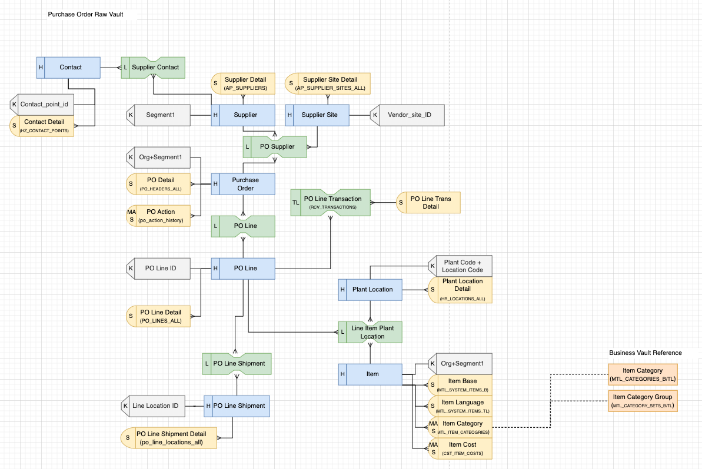
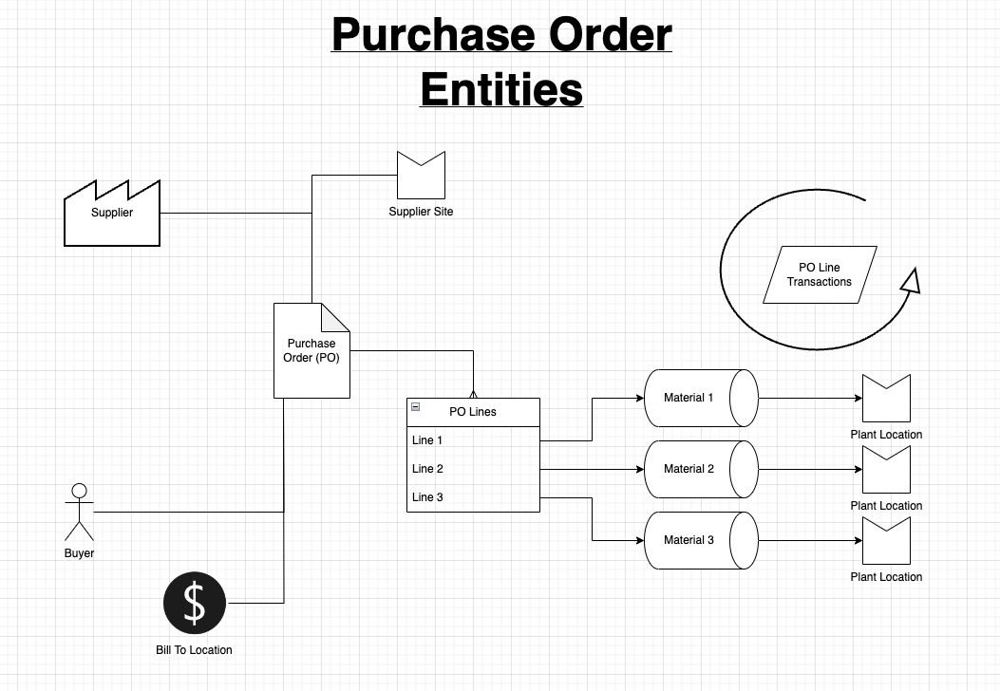

# Purchase Order Data Vault Diagram
The initial conceptual model for Purchase Order (AKA Supply Chain) was partially derived from previous Moen and Master Lock models, but also heavily from Emtek discovery. It does not currently encompass all Supply Chain activities, but just those centered around a purchase order.

**Note:** Emtek data comes from an Oracle EBS (ERP system) so in parentheses you will see references to Oracle EBS tables.

The original business diagram that helped guide the Data Vault model:
