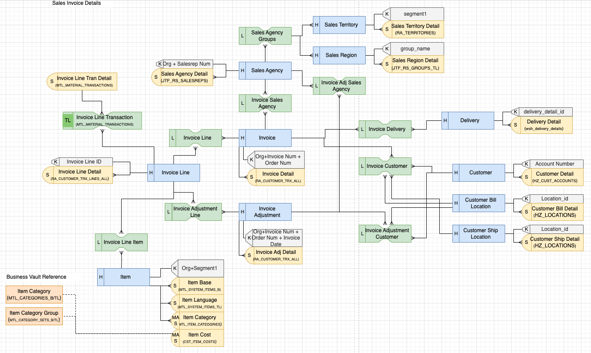
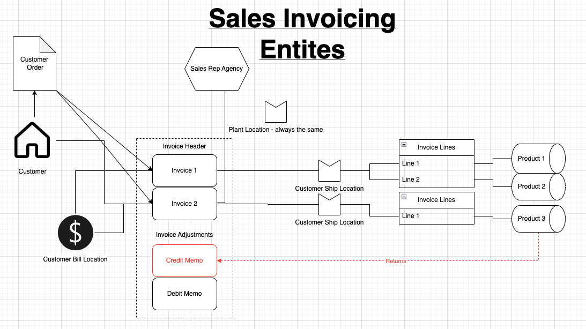

# Sales Invoice Data Vault Diagram
This initial conceptual model for Sales Invoicing was based on business input from Emtek and data discovery of their ERP data. It is labelled "Sales Invoicing" as it is centered around the invoice that is generated when products are shipped to customers. It does not cover all of Order Management (prior to sales invoicing) or Accounts Receivable (after sales invoicing).

**Note:** Emtek data comes from an Oracle EBS (ERP system) so in parentheses you will see references to Oracle EBS tables.

The original business diagram that helped guide the Data Vault model:

