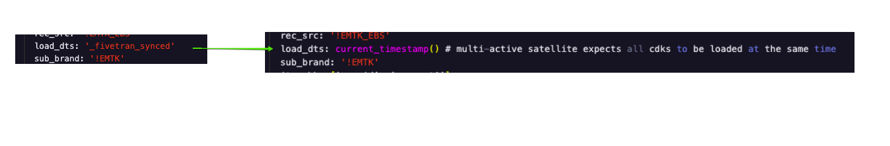
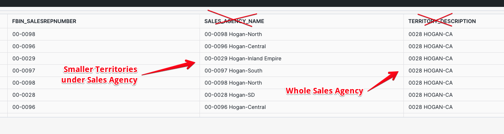

# Lessons Learned
Use this section to post examples of development that may have appear more complex due to lessons we learned about how dbt and Data Vaulting works. It can also be data specific as sometimes the code needs to react to the data.

## Table of Contents
- [Multi-Active Satellites - load_dts](#multi-active-satellites-load_dts)

## Multi-Active Satellites - load_dts
If using [AutomateDV to build your Multi-Active satellites](https://automate-dv.readthedocs.io/en/latest/tutorial/tut_multi_active_satellites/), be careful with how you define the value for `load_dts`.

**Problem Observed:** The source data was not changing, but new duplicate rows were added to the satellite on each run.

**Cause:** The value for `load_dts` was using `_fivetran_synced` which different across the CDKs (child dependent keys) for a given PK.

**Fix:** Use `current_timestamp()` function to ensure the stg view returns the same `load_dts` value for each set of CDKs.



## Emtek Sales Agencies and Territories
After several meetings with Tammi and Desa Rae, it finally became clear that the Emtek business refers to Sales Agencies and Sales Territories in the reverse of how they are stored in Oracle.

Data stored in `emtk_ebs_jtf.jtf_rs_salesreps` = sales territories
Data stored in `emtk_ebs_ar.ra_territories`  = sales agencies

To further illustrate this:


## Lesson #39 — SNP GLUE GLCHANGETIME: Fractional Seconds Beyond Position 14

**Problem:** `TO_TIMESTAMP(GLCHANGETIME, 'YYYYMMDDHH24MISS')` fails or produces incorrect results for SNP GLUE sources.

**Root Cause:** `GLCHANGETIME` is a `NUMBER` column (not VARCHAR/TIMESTAMP). Its format is `YYYYMMDDHHMMSS.microseconds` where fractional seconds begin at position 16 (after a `.` separator at position 15). A simple 14-character format mask does not account for this and causes Snowflake to error or silently truncate the sub-second precision.

**Correct Formula:**
```sql
IFF(
  PSA_DELETE_IND = 'Y',
  PSA_LOAD_DTS,
  CONVERT_TIMEZONE('UTC',
    TO_TIMESTAMP_NTZ(
      SUBSTR(GLCHANGETIME, 1, 14) || '.' || SUBSTR(GLCHANGETIME, 16),
      'YYYYMMDDHH24MISS.FF9'
    )
  )
) AS LOAD_DTS
```

**Key points:**
- Use `TO_TIMESTAMP_NTZ` (not `TO_TIMESTAMP`)
- `SUBSTR(GLCHANGETIME, 1, 14)` extracts the `YYYYMMDDHHMMSS` component
- `SUBSTR(GLCHANGETIME, 16)` skips the `.` at position 15 and extracts fractional digits
- `'YYYYMMDDHH24MISS.FF9'` format mask handles up to 9 fractional second digits
- This pattern is required for **all SNP GLUE sources** (any table ingested via SNP GLUE CDC replication)

