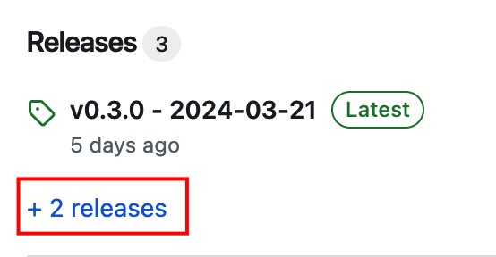
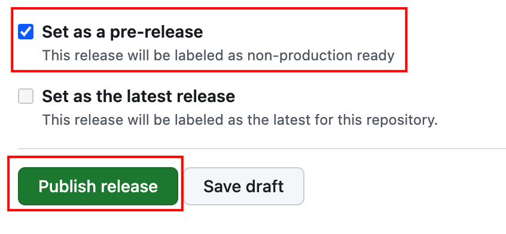
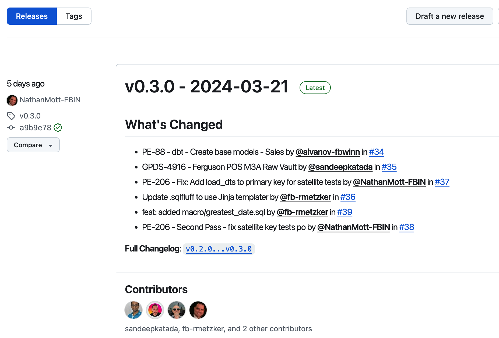

# Release

Instead of using a PR to merge from one branch to another, we are using Github Pre-Release to merge from the `dev` branch to the `qa` branch and from the `qa` branch to the `main` branch. Why are we doing it this way?

* Repo `dbt-datavault` is a monorepo, which means that we have code changes from multiple projects in the `dev` branch. Packaging the changes into a Release is a more organized and structured way of integrating code to another branch.
* We run automated integrated/functional tests against the code changes with the appropriate acceptance and compliance criteria of promoting the code to a higher environment at this stage of the process.

## Types of Release

Release can refer to:

* A **release** (with a small r) representing an abstract release to "protected" environments such as `qa` and `prod`. 
* A **Release** (with a big r) representing a Github Release, a snapshot of all the changes (or commits) since the last Release. We will be using Github Release extensively as part of our workflow. 

> **Note**
> 
> We are still actively improving the workflow for this repo. For Pre-Releases and Releases, let the senior engineers handle this activity for now. We will change this policy once the process is more mature and individuals are more familiar with the process.

## Github Release 

There are 2 kinds of (Github) Releases:

* Pre-Release - This is a Release from `dev` to `qa`. Be sure to check the Pre-Release checkbox - see below for details.
* Release - This is a Release from `qa` to `prod`.

### Create Github Pre-Release

1. Go to the main page of the repo. Under the Release section of the right pane, select the **+ releases**.

   

1. On the next page, select the **Draft a new release** button.

   

1. On the editor page, do the following.
   1. Create a new **tag** that corresponds to a new version using an appropriate semantic version eg. `v0.3.0`.
   1. **Target** should almost always going to be `dev` for most scenarios.
   1. For the **title**, use this naming convention: `<version-tag> - YYYY-MM-DD`, basically the version tag you created followed by a dash and a timestamp with 4-digit year, 2-digit month, and 2-digit day. 
   1. Select the **Generate release notes** to fill the description with a log of commits since the last Release.
   1. **Important!** Check the **Set as a pre-release** checkbox. This way only the CD job workflow will be triggered for building and deploying the changes in `dev` to the `qa` environment.

   

### Github Release 

1. When we are ready to release to prod, we uncheck the pre-release flag and publish the Release.
1. We should now see the Release in the Releases page.

   