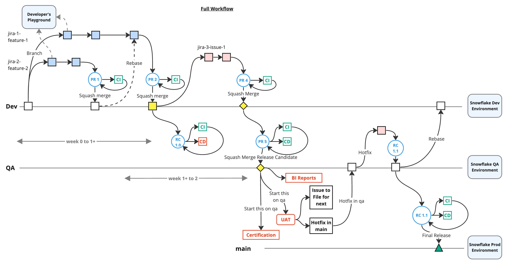
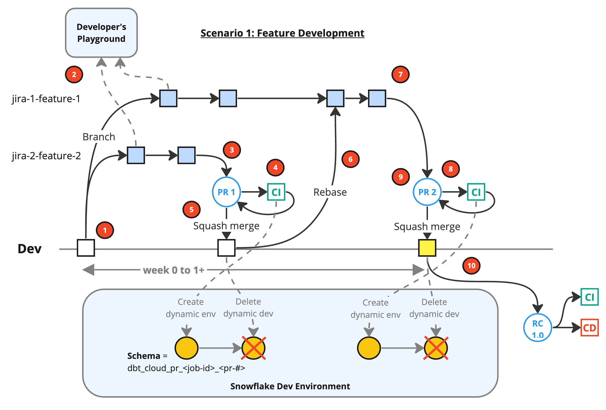
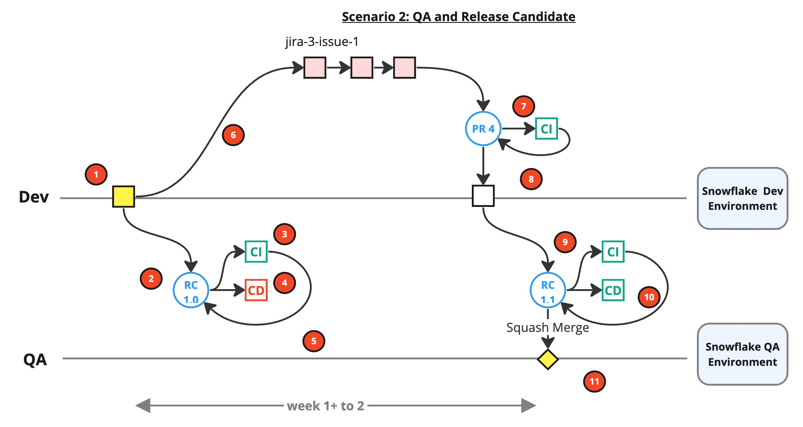
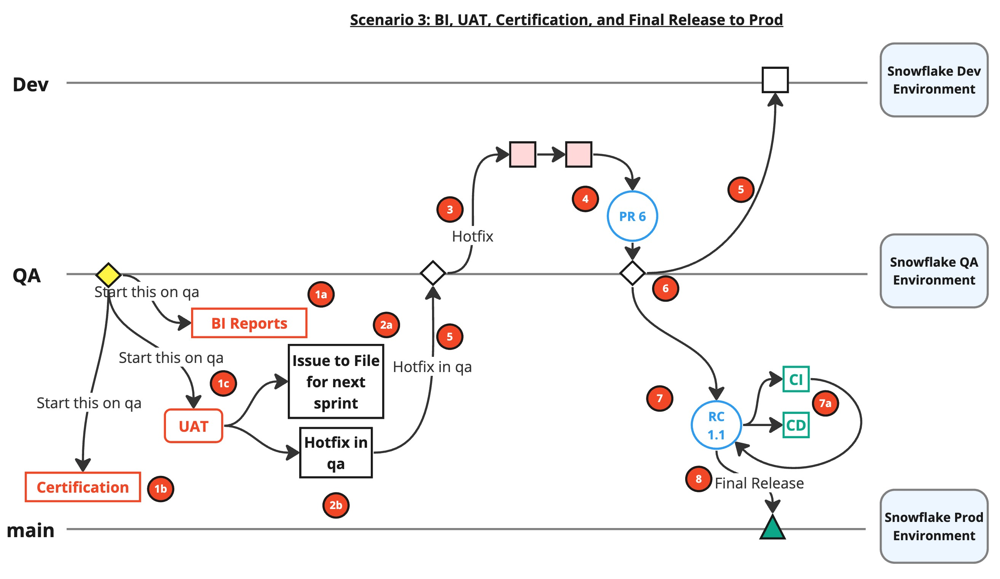

# Workflow

A workflow is a sequence of steps that engineers can use to accomplish their work using git, github, and dbt, in a consistent and productive manner. Our workflow is based on git flow with modification for dbt and borrowing of some elements from the Three-flow workflow.

Our workflow is designed to support 3 key scenarios in the project:

* Feature development
* QA and release candidate
* BI, UAT, certification and final release to production

## Branches

There are 4 primary branches used in our workflow.

* Feature/fix: A class of branches that contain all local development code objects worked upon by an engineer. The name of feature/fix branches are not hardcoded to a static text. See [Branch Naming Conventions](branch.md#branch-naming-convention) for details.
* `dev`: The branch named `dev` that contains the latest fixes and features. 
  * This branch is associated with the dev environment on Snowflake. See table below for details.
  * This branch should contain commits that are ahead of `qa` and `main` branches.
  * Occasionally, when we have the relevant features added to the `dev` branch, we will cut a **pre-release** ie. Github Release with the pre-release flag enabled. The **pre-release** is tagged with a semantic version and consists of features and fixes we want to merge to the `qa` branch.
* `qa`: The branch named `qa` is where code and models that we develop are exposed to other members of the pod and even Business for testing (functional and UAT), data certification, and the development of analytics and reports.
  * We validate if the `qa` environment meets our functional requirements and compliance & control policies. If everything validates, we publish the **pre-release** to the `main`. Github performs related operations to merge the changes from `qa` to `main`.
  * This branch is associated with the qa environment on Snowflake.
* `main`: The branch named `main` that reflects the current state of production environment.
  * This branch contain code and models that are used to build the objects for production.

## Feature Development

This is the part of the workflow that represents feature development. This is where a sprint starts and the contributors of all pods start to actively develop on this project. Here are the steps:

1. Let's suppose we create 2 feature branches from `dev`. See standards on [branching](branch.md) including naming the branch to a JIRA card.
2. The feature branches should run on an engineer's `playground` or the `dev` environment on Snowflake.
3. Engineer completes feature branch 2 and create PR #1. See [pull request standards](commit_pr.md#pull-request) for details.
4. CI is triggered by the new PR and runs the following:
   a. Build a temp schema, which a part of the dbt Cloud job. See [dbt Cloud Job Run](#dbt-cloud-job-run-for-pr) for details.
   b. Runs lint and unit tests against the schema.
5. Once the PR is approved, (squash) merged into `dev`, and closed, the temp schema will be removed automatically by the system.
6. Rebase the `dev` branch to feature branch 1, the other feature branch, to sync. See [rebase](commit_pr.md#rebase) for details.
7. Engineer completes feature branch 1 done and creates PR #2.
8. CI runs.
9. Assume all validations pass, PR squash merged and closed.
10. Creates pre-release #1 (aka release candidate), which includes both PR #1 and PR #2 changes. This triggers the CD workflow on Github Actions to replace QA Branch with RC #1 code and runs a deploy job to Snowflake `qa`.

## QA and Release Candidate

In this scenario, the pods have made strides in feature development and is ready to cut a release candidate to push changes to the `qa` branch and environment to integrate and test the multiple changes on Snowflake.

> **Notes**
>
> For now, the documentation assumes a single release that is to be performed at the end of a sprint. As the process matures and team is able to attain higher cadence, we can have more frequent releases. In fact, we aim to have continuous delivery with better automation and engineering practices in the future that will enable us to have a higher cadence for delivery.

1. Continuing from the previous section, we have pre-release #1 tagged with version `0.1.0` and merged it to `qa`. We initiate a **code freeze** deadline, which means the following.
   a. We now have a pre-release, which is a snapshot of the changes that now fully merged to `qa`.

   > **Note**
   >
   > Here's the definition of **code freeze**:
   >
   > * There are no more features (as opposed to fixes) will be added to the pre-release. There might be exceptions.
   > * If you are working on a feature on a fix/feature branch, **code freeze** should not prevent new features from being worked on against the `dev` branch. So when you are done with your feature work, create a PR to merge it `dev` (as opposed to the pre-release). We may need to keep PRs to `dev` open until pre-release is officially released. 

2. Pre-release #1, tagged with version `0.1.0`, triggers the CD workflow.
3. CI on Github Actions runs the linter and unit tests.
4. CD runs:
   a. Trigger a GH Action to build the changes on the `qa` branch onto the qa environment on Snowflake.
   b. If there are automated tests, we run them.
5. QA analyst perform testing on `qa`. If there are issues found in `qa`, there are 2 ways we can address this:
   a. The issue should be part of the current release.  
   b. The issue can be deferred to the next release. 
   d. If an issue can be deferred, engineers will continue their work, committing to the feature or fix branches (depending on what he/she is working on) and merging to the `dev` branch when done. This is the same as before.
6. Assuming that the issue is pressing, qa analyst file a bug on JIRA and assign it to the engineer to fix. The engineers will create a fix branch from `dev` and fix the issues on a fix branch - see [branching](branch.md) for details. Engineer picks up the JIRA ticket and creates an issue branch from dev branch to start fixing.
   a. Concurrently, BI eng builds reports and QA/business perform UAT in the QA environment.
7. Engineer completes fix, creates PR #4, goes through a code review, and merges the fix branch to `dev` assuming that validation passes. See [pull request standards](commit_pr.md#pull-request) for details.
8. After we successfully validate the `qa` environment, we will publish the pre-release as a Release tagging it as version `0.1.1` to production.
9. Create pre-release #2 to merge dev to qa, kick off CI and CD. QA analysts tests and pass.
10. Release merges to qa branch triggers build and changes are made to the Snowflake QA Database.
11. We now have a pre-release in `qa`. 

## BI, UAT, Certification and Final Release to Production

In this scenario, we are focus on how the data can finally be used by people outside of Data Platforms. The project is now in the right position for a release to the `main` branch and environment.

1. The following people can start using the Snowflake QA environment:
   a. Business Intelligence (BI) engineers to start building reports.
   b. Data Management (DM) to start the certification process.
   c. Business stakeholders to start User Acceptance Testing (UAT).
2. Any issue found, we have 2 options:
   a. Defer the fix till next sprint.
   b. Fix the issue now. So we hotfix from `qa`.

   > **Notes**
   > 
   > If we need to get fix into the release this close a release , we can't branch the fix feature off from the `dev` like we did in the previous section. Instead, we will do a **hotfix** and create a fix feature off from `qa`. Once the fix is merged to `qa`, we will rebase `qa` to `dev` to sync. We cut another pre-release for release to prod.
   >
   > Hotfix don't follow a prescribed flow but it falls outside of the status quo and it's needed because of the urgency of including the fix in the release. Things like nulls making it into a table because the not null constraint was omitted would probably not fall under a hotfix. It's preferred that any less severe issues we find in pre-release are instead scheduled for the next release and we work on the fix in the `dev` branch.

3. For hotfix, create a hotfix branch from `qa`.
4. Eng develops a fix in `qa`. Create PR #6, have QA do a quick smoke test (only), and merge if validation passes.
5. If we perform a hotfix on `qa`, rebase changes in `qa` to `dev` to sync.
6. If there's no hotfix, we just publish the current pre-release to `main`. 
7. If there are hotfixes, remove any pre-releases we currently have, create a pre-release off of `qa` and then publish this pre-release to `main`.
8. For final release, trigger Github Actions workflow deploy the release to `main` and then to production on Snowflake.

## Practices

Please read the practice standards for:

* [Branching](branch.md)
* [Commit and Pull Request](commit_pr.md)
* [Code Style](code_style.md)